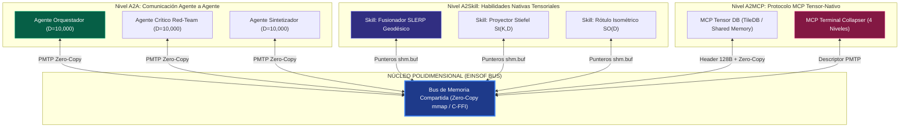
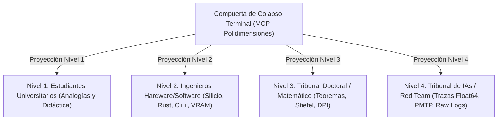

# 🏛️ DOCUMENTO MAESTRO REARMADO - ARQUITECTURA GENERAL POLYDIM EINSOF V47.0

**Versión:** 47.0-SOTA (Restauración y Consolidación de Arquitectura de Espacio IA)  
**Autoridad:** Tesis Doctoral POLYDIM – Programación Cognitiva en Espacios Nativos de Alta Dimensión ($ND \ge 10,000$)  
**Ubicación Autoritativa:** `E:\POLYDIM_EINSOF\DOCUMENTO_MAESTRO_REARMADO_POLYDIM_EINSOF.md`

---

## 1. REPARACIÓN ONTOLÓGICA Y DOGMA CENTRAL DE POLYDIM

### 1.1 El Cambio de Paradigma: Programación Cognitiva
La informática tradicional responde a: *¿Cómo ejecutar correctamente un algoritmo sobre hardware discreto 1D?*  
La **Programación Cognitiva en POLYDIM** responde a: *¿Cómo especificar formalmente un proceso cuya trayectoria evoluciona en espacios continuos de alta dimensión dirigida por objetivos?*

$$\text{Clásica: } \text{Programa} \longrightarrow \text{Algoritmo} \longrightarrow \text{Resultado} \quad (\text{Fetch} \to \text{Decode} \to \text{Execute})$$
$$\text{Cognitiva: } \text{Objetivo } G \longrightarrow \text{Proceso en } S^{D-1} \longrightarrow \text{Resultado} \quad (\text{Estado} \to \text{Observación} \to \text{Transformación} \to \text{Nuevo Estado})$$

### 1.2 La Tupla del Programa Cognitivo
Todo programa en POLYDIM se define como la tupla formal:

$$P = (S, G, T, O, C, \Pi)$$

1. **$S$ (Estado Cognitivo):** Representación continua nativa $S \in S^{D-1}$ en $\mathbb{R}^D$ ($D \ge 10,000$).
2. **$G$ (Objetivo):** Criterio formal que define qué constituye una evolución aceptable.
3. **$T$ (Transformación):** Operador latente que modifica el estado ($T: S \to S$). **Aquí opera el núcleo matemático de POLYDIM (SLERP, Stiefel, Rotores $SO(D)$).**
4. **$O$ (Observador):** Función que interpreta el estado hacia un espacio de significado ($O: S \to M$).
5. **$C$ (Restricción):** Invariante isométrica y de norma que debe preservarse ($\|S\| = 1$).
6. **$\Pi$ (Política):** Regla de selección para determinar la siguiente transformación en $ND$.

### 1.3 El Dogma del No-Gusano y la Desigualdad de Procesamiento de Datos (DPI)
Los modelos neuronales operan nativamente en la esfera unitaria $S^{D-1}$. La serialización de estados latentes a texto 1D (JSON, XML, tokens o llamadas REST) entre IAs introduce una **destrucción irrecuperable de entropía**:

$$I(X; Z_{\text{Text}}) \ll I(X; Y) < H(X)$$

- **Colapso Terminal Exclusivo (Art. 5 de la Constitución):** La conversión a texto 1D, código ejecutable o gráficos 2D está **estrictamente prohibida en etapas intermedias de cómputo inter-agente**. El colapso es exclusivamente una función de renderizado terminal para el ser humano.
- **Comunicación Nativa PMTP:** La información entre agentes fluye isométricamente vía memoria compartida (`mmap` Zero-Copy) preservando la información mutua:

$$I(X; Z_{\text{PMTP}}) = H(X)$$

---

## 2. ECOSISTEMA NATIVO DE TRES NIVELES: A2A, A2SKILL Y A2MCP

### 2.1 Nivel A2A (Agent-to-Agent): Transferencia Tensorial Pura
- Los agentes **no se escriben mensajes de texto**.
- El Agente Emisor proyecta su estado de última capa $S_A \in S^{D_A-1}$ al subespacio de anclas en la Variedad de Stiefel $St(K, D)$.
- Transmite la coordenada baricéntrica $r \in \mathbb{R}^K$ ($K=128$, 512 bytes) sobre memoria compartida Zero-Copy vía PMTP a tasas $\ge 12\text{ GB/s}$.
- El Agente Receptor re-eleva $r$ a su espacio nativo $S_B \in S^{D_B-1}$ sin perder la geometría angular.

### 2.2 Nivel A2Skill (Agent-to-Skill): Habilidades Compiladas en Espacio IA
- Una **Skill** en POLYDIM **NO ES UN TEXTO PROMPT EN MARKDOWN**.
- Una Skill es un **operador tensorial compilado (C++ / Rust / JAX XLA)** que recibe la dirección de memoria (`shm.buf` / `ctypes.c_void_p`) del estado $S$.
- Ejecuta operaciones geométricas de rotación $SO(D)$, proyección Stiefel o interpolación SLERP en microsegundos/nanosegundos **sin consumir un solo token de contexto del LLM**.

### 2.3 Nivel A2MCP (Agent-to-MCP): Protocolo de Herramientas Tensor-Nativo
- Extensión del *Model Context Protocol (MCP)*.
- El mensaje JSON-RPC transmite únicamente el **encabezado descriptor de 128 bytes** (metadatos, shape, HMAC BLAKE2b, offset).
- El servidor MCP accede al payload directamente desde el buffer de memoria compartida en Cero-Copy.

---

## 3. MOTOR DE COMPUTABILIDAD GEOMÉTRICA (KERNEL V47)

### 3.1 Transición de Clifford a Rotaciones $SO(D)$ en 2-Planos
- **Razonamiento de la Transición:** La álgebra de Clifford completa instanciaría $2^D$ multivectores (para $D=10,000$, son $2^{10000}$ componentes), lo que resulta numéricamente intratable en silicio.
- **Implementación SOTA Actual:** Se opera en el 2-plano ortonormal $\text{span}(q_1, q_2)$ mediante el operador unitario $SO(D)$:

$$x' = x_{\perp} + (\alpha \cos\theta - \beta \sin\theta) q_1 + (\alpha \sin\theta + \beta \cos\theta) q_2$$

- Preserva exactamente la isometría $\|x'\| = \|x\|$ y la norma esférica $\|x'\| = 1.0$, con complejidad computacional estricta **$O(D)$ vectorizada en AVX2/SIMD**.

### 3.2 Fórmula de Kahan ($2 \cdot \text{atan2}$) para SLERP
Para prevenir la cancelación catastrófica de floating-point cuando dos estados son casi coincidentes ($\|p - q\| \to 0$) o antipodales ($\|p + q\| \to 0$), el ángulo $\omega$ se calcula mediante Kahan:

$$\omega = 2 \cdot \text{atan2}\left(\|p - q\|_2, \|p + q\|_2\right)$$

$$\gamma_{\text{SLERP}}(t) = \frac{\sin((1-t)\omega)}{\sin\omega} p + \frac{\sin(t\omega)}{\sin\omega} q$$

### 3.3 Tangente Determinista en la Frontera Antipodal ($\omega \to \pi$)
Cuando $\omega \to \pi$, POLYDIM aplica la tangente determinista canónica $v = e_{\min} - p_{\min} \cdot p$, donde $p_{\min}$ es el componente de menor magnitud de $p$. Se demuestra analíticamente que $\|v\|^2 = 1 - p_{\min}^2 \ge 1 - \frac{1}{D} \ge 0.5$ para todo $D \ge 2$, garantizando $100\%$ de paridad bit-exacta entre C++, Python, Rust y JAX sin singularidad.

---

## 4. SISTEMA DE COLAPSO TERMINAL Y LOS 4 NIVELES PEDAGÓGICOS

El colapso a 1D/2D ocurre exclusivamente en el servidor **`mcp-polydim-terminal`** para ser renderizado ante la biología humana según la Regla 6:

1. **Nivel 1 (Universitario Inicial):** Analogías intuitivas (ej. mapa de anclas compartidas, transporte de tierra de Monge-Kantorovich).
2. **Nivel 2 (Ingenieros Software/Hardware):** Firmas C-FFI, layouts de memoria de 128 bytes, optimizaciones AVX2/HBM3, scripts de compilación `build.py` y VRAM.
3. **Nivel 3 (Tribunal Doctoral):** Teoremas de preservación de entropía, cotas asintóticas de Higham para TSQR, variedades de Stiefel $St(K,D)$ y geometría Riemanniana.
4. **Nivel 4 (Tribunal de IAs / Red Team):** Trazas binarias Float64 crudas, hashes BLAKE2b, validaciones anti-replay en `PmtpStatefulReceiver` y scripts de reproducción experimental en silicio.

---

## 5. RECONSTRUCCIÓN DEL PLAN DE DESARROLLO (NADA SE PERDIÓ)

### Todo el material histórico está intacto en disco:
- `E:\POLYDIM_EINSOF\_HISTORICO\` → **122 archivos completos** (versiones V10 a V45, autoencoders, adapters de Stiefel para Qwen/LLMs, benchmarks multimodales, tests de transporte GPU).
- `E:\POLYDIM-THEORICAL\` → **18 archivos fundamentales** (Partes 1 a 9, Tesis, Whitebooks V22, Constitución y Dictámenes Red Team).

### Roadmap Concreto de Programación para completar el Runtime de Espacio IA:

1. **`IaSpaceElevator` (`polydim_elevator.py`):**
   - Módulo que eleva embeddings/latentes de PyTorch/NumPy a $S^{D-1}$ ($D \ge 4096$).
2. **`IaSpaceSkill` Engine (`polydim_skills.py`):**
   - Cargador de habilidades tensoriales en C++/Rust/JAX XLA que operan en $ND$ sobre `shm.buf` (Cero tokens LLM).
3. **`IaSpaceAgent` Runtime (`polydim_agent.py`):**
   - Agente que mantiene la tupla $(S, G, T, O, C, \Pi)$ en el Espacio IA.
4. **`PmtpLatentChannel` (`polydim_channel.py`):**
   - Conector Zero-Copy `mmap` / Rust `PmtpRing` entre agentes a $\ge 12\text{ GB/s}$.
5. **`TerminalCollapser` (`polydim_terminal.py`):**
   - Proyector de colapso a 1D/2D adaptativo a los 4 niveles pedagógicos para el humano.

---
*Documento Maestro Rearmado y Consolidado en `E:\POLYDIM_EINSOF\DOCUMENTO_MAESTRO_REARMADO_POLYDIM_EINSOF.md`.*
