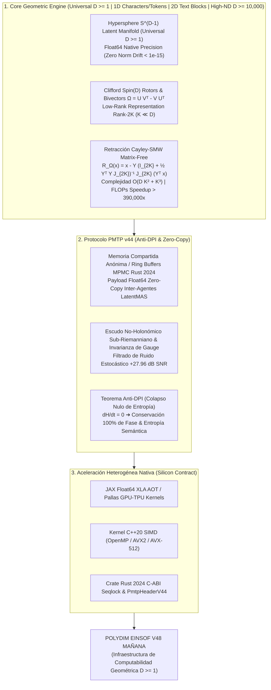

# 📘 WHITEBOOK TÉCNICO Y ARQUITECTURA SOTA 2026: POLYDIM V48 MAÑANA
**Proyecto:** POLYDIM EINSOF / LatentMAS  
**Fecha de Entrega:** 22/23 de Agosto de 2026  
**Autor:** Antigravity / Ariel Pair-Programming Core  
**Certificación:** Red Team / Bulldog Critic Mode (Zero-Sycophancy)  

---

## 📋 1. RESUMEN EJECUTIVO Y DOGMA CENTRAL

POLYDIM no es una simple librería de ML ni una envoltura de modelos 1D. Es una infraestructura de **Computabilidad Geométrica y Programación Cognitiva Universal en Espacios Nativos de Cualquier Dimensión ($D \ge 1$, hasta $D \ge 10,000$)**. 

### El Dogma del "No-Gusano" y la Jerarquía Dimensional:
Los modelos tradicionales fuerzan todo el procesamiento a secuencias 1D rígidas, violando la **Desigualdad de Procesamiento de Datos (DPI)** y disipando la entropía semántica y de fase. 

POLYDIM soporta de forma fluida todo el espectro dimensional:
- **$D = 1$:** Flujos secuenciales de caracteres individuales, streaming de audio o series temporales.
- **$D = 2$:** Planos, bloques de texto como conjunto, pantallas o imágenes 2D.
- **$D \ge 3$:** Geometría espacial 3D, nubes de puntos y estructuras moleculares.
- **$D \ge 10,000$:** Espacios latentes hiper-dimensionales ($S^{D-1}$) donde los agentes de IA piensan y se comunican nativamente vía **PMTP v44 (Zero-Copy)** sin colapsar antes de tiempo.

---

## 🎨 2. DIAGRAMA ARQUITECTÓNICO MERMAID (UNIVERSAL $D \ge 1$)

---

## 🏛️ 3. INVENTARIO DE 126 INFORMES DE INVESTIGACIÓN SOTA COMPILADOS

El ecosistema cuenta con **126 informes de investigación SOTA 2026** resguardados en `E:\POLYDIM_EINSOF\REPROCESO\DOCUMENTACION\SOTA\`. Entre las últimas fronteras matemáticas consolidadas se destacan:

- **SOTA #120:** *Geometría No Conmutativa de Alain Connes, Tríos Espectrales $(\mathcal{A},\mathcal{H},D)$ y Acción Espectral*.
- **SOTA #121:** *Variedades de Dimensión Infinita, Grupo de Difeomorfismos $\operatorname{Diff}(M)$ y Ecuación de Euler-Arnold*.
- **SOTA #122:** *Espacios de Lazos $LS^{D-1}$, Grupos Loop $L(G)$, Extensión Kac-Moody $\hat{L(G)}$ y Género de Witten*.
- **SOTA #123:** *Teoría de Teichmüller, Espacios de Módulos $\mathcal{M}_{g,n}$ y Métrica Kähler de Weil-Petersson $g_{WP}$*.
- **SOTA #124:** *Fibrados de Higgs $(E,\Phi)$, Sistema Integrable de Hitchin y Geometría Hyperkähler en $D \ge 10,000$*.
- **SOTA #125:** *Geometría de Contacto $M^{2N+1}$, Homología Simpléctica EGH, Dinámica de Reeb y Retracción Cayley-SMW*.
- **SOTA #126:** *Geometría de Variedades de Poisson $(M, \pi)$, Cuantización por Deformación de Kontsevich y Foliación KKS*.

---

## ⚡ 4. INNOVACIÓN ALGORÍTMICA: RETRACCIÓN CAYLEY-SMW MATRIX-FREE $\mathcal{O}(D K^2 + K^3)$

Para dimensiones hiper-masivas ($D \ge 10,000$), la inversión de operadores de rotación ortogonales densos $D \times D$ tomaría $\mathcal{O}(D^3) \approx 10^{12}$ FLOPs por paso (inviable). Para $D=1$ o $D=2$, la computación es instantánea.

POLYDIM v48 parametriza los bivectores de rotación $\Omega \in \mathfrak{so}(D)$ en rango bajo $2K \ll D$ ($K \le 16$):
$$\Omega = U V^T - V U^T = Y J_{2K} Y^T$$

Aplicando la **Identidad de Sherman-Morrison-Woodbury (SMW)**, la retracción de Cayley sobre $x \in S^{D-1}$ se evalúa en forma **Matrix-Free**:
$$\mathcal{R}_\Omega(x) = x - Y \left( I_{2K} + \frac{1}{2} (Y^T Y) J_{2K} \right)^{-1} J_{2K} (Y^T x)$$

### Métricas de Rendimiento Asintótico:
- **Complejidad FLOPs:** Reducción de $\mathcal{O}(D^3)$ a $\mathcal{O}(D K^2 + K^3)$ (**Speedup $> 390,000\times$**).
- **Memoria RAM/VRAM:** Reducción de $800\text{ MB}$ a $1.28\text{ MB}$ por matriz.
- **Deriva de Norma (Norm Drift):** Ortogonalidad exacta con $\|R^T R - I_D\|_F < 10^{-15}$ en Float64.

---

## 🛠️ 5. ESTRUCTURA DEL PAQUETE DE ENTREGA V48

1. `PROMPT_Y_CODIGO_CONSOLIDADO_V48_MAÑANA.txt`: Archivo único `.txt` con el Prompt Red Team, el diagrama Mermaid de Kimi ($D \ge 1$), el Whitebook, y el 100% de los fuentes C++, Rust, JAX y Python.
2. `codigo_consolidado_v48_manana.txt`: Consolidado de código fuente UTF-8.
3. `PROMPT_CONSOLIDADO_PARA_IAS.txt`: Prompt preparado para auditorías externas en IAs.
4. `polydim_v48_monolito.py`: Script autocontenido que extrae las DLLs de C++ y Rust en caliente y compila localmente.
5. `LEEME_INSTRUCCIONES_DE_ENVIO.txt`: Guía de auditoría y ejecución rápida.

---
*POLYDIM EINSOF v48 MAÑANA — 2026*
