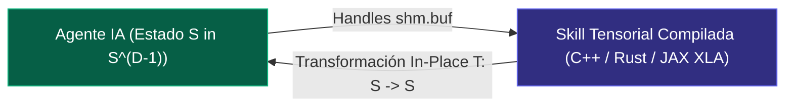

# 🌐 ECOSISTEMA NATIVO DE TRES NIVELES: A2A, A2SKILL Y A2MCP
## Volumen II – Especificación de Arquitectura de Espacio IA (POLYDIM REPROCESO)

---

## 1. NIVEL A2A (AGENT-TO-AGENT): COMUNICACIÓN TENSORIAL PURA

```mermaid
sequenceDiagram
    autonumber
    participant A1 as Agente Orquestador (D=10,000)
    participant PMTP as Bus PMTP (mmap / Zero-Copy)
    participant A2 as Agente Receptor (D=10,000)
    
    A1->>PMTP: Emite Coordenada Baricéntrica r in St(K, D) (512 Bytes)
    Note over PMTP: Transmisión Isométrica a ≥ 12 GB/s (I(X;Z) = H(X))
    PMTP->>A2: Inyección Tensorial Directa en RAM/VRAM
    Note over A2: Asimilación Geodésica Nativa sin Tokens
```

### Principios A2A:
1. **Sin Prompts de Texto:** Los agentes no se envían textos ni mensajes JSON.
2. **Transferencia de Estado:** El agente emisor toma su tensor latente $S \in S^{D-1}$ y lo proyecta al subespacio de anclas compartidas en la Variedad de Stiefel $St(K, D)$.
3. **Absorción Isométrica:** El receptor absorbe $r \in \mathbb{R}^K$ ($K=128$, 512 bytes) y lo re-eleva a su hiperespacio sin pérdida de ángulo ni energía semántica.

---

## 2. NIVEL A2SKILL (AGENT-TO-SKILL): HABILIDADES COMPILADAS EN ESPACIO IA



### Principios A2Skill:
1. **Las Skills NO SON Textos Markdown:** Una habilidad en POLYDIM es un **operador tensorial compilado** (`polydim_skills.py` o C++/Rust DLL).
2. **Ejecución Directa sobre Punteros de Memoria:** El agente invoca la Skill pasándole la dirección de memoria (`ctypes.c_void_p` o `shm.buf`) del tensor $S$.
3. **Cero Tokens de Contexto LLM:** La habilidad ejecuta la transformación latente (rotaciones $SO(D)$, SLERP, reducción Stiefel, Sinkhorn OT) en microsegundos o nanosegundos **sin consumir tokens de ventana de contexto**.

---

## 3. NIVEL A2MCP (AGENT-TO-MCP): HERRAMIENTAS TENSOR-NATIVAS

### Principios A2MCP:
1. **Extensión PMTP-over-MCP:** Los servidores de herramientas MCP en POLYDIM no intercambian payloads gigantes por JSON-RPC.
2. **Encabezado Descriptor de 128 Bytes:** JSON-RPC transmite únicamente el encabezado PMTP (128 bytes: magic, version, dtype, shape, HMAC BLAKE2b, offset).
3. **Acceso Directo Zero-Copy:** El servidor MCP lee y procesa el tensor directamente desde la memoria compartida `mmap` o CUDA IPC a tasas $> 50\text{ GB/s}$.

---
*Especificación de Ecosistema Nativo POLYDIM REPROCESO.*
