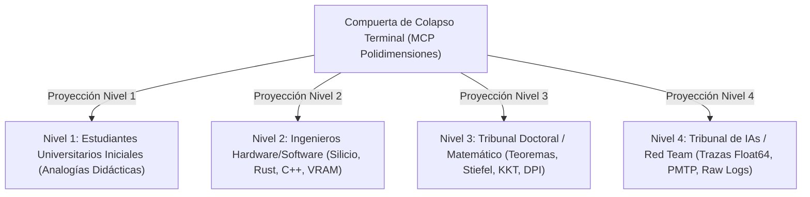

# 👁️ SISTEMA DE COLAPSO TERMINAL Y LOS 4 NIVELES PEDAGÓGICOS
## Volumen III – Compuerta de Proyección MCP Terminal (POLYDIM REPROCESO)

---

## 1. LA FILOSOFÍA DEL COLAPSO TERMINAL

El cerebro humano no percibe tensores de $D = 10,000$ dimensiones. La percepción biológica requiere colapsos a cadenas 1D (texto/audio) o planos 2D (pantallas/documentos).

Por lo tanto:
- **En Espacio IA ($ND$):** Se preserva la información mutua ($I(X;Z) = H(X)$). Cero texto.
- **En la Frontera Terminal:** El servidor `mcp-polydim-terminal` aplica la función Observador $O(S)$ únicamente al finalizar la deliberación para renderizar el resultado ante el ser humano.

---

## 2. LOS 4 NIVELES PEDAGÓGICOS DE PROYECCIÓN (REGLA 6)

### 2.1 Nivel 1: Estudiantes Universitarios Iniciales
- **Objetivo:** Didáctico e intuitivo, sin formalismos densos ni jerga incomprensible.
- **Formato:** Analogías físicas (ej. mapa de anclas compartidas, transporte de tierra de Monge-Kantorovich), lenguaje claro y diagramas conceptuales.

### 2.2 Nivel 2: Ingenieros de Software y Hardware
- **Objetivo:** Especificación técnica ejecutable, perfiles de memoria, optimizaciones y silicio.
- **Formato:** Layouts de 128 bytes, firmas de C-FFI, scripts de compilación `build.py`, consumos de VRAM, buses de datos y código ejecutable.

### 2.3 Nivel 3: Tribunal Doctoral y Matemático
- **Objetivo:** Rigor formal analítico, teoremas y consistencia asintótica.
- **Formato:** Demostraciones paso a paso, variedad de Stiefel $St(K,D)$, acotación de Higham para TSQR, métricas de Kahan atan2 y Desigualdad de Procesamiento de Datos (DPI).

### 2.4 Nivel 4: Tribunal de IAs y Red Team Adversarial
- **Objetivo:** Verificación determinista empírica sin sesgos ni alucinaciones.
- **Formato:** Payloads PMTP en Float64 crudos, checksums HMAC BLAKE2b, validaciones anti-replay y scripts de reproducción destructiva en silicio.

---
*Especificación de Colapso Terminal POLYDIM REPROCESO.*
