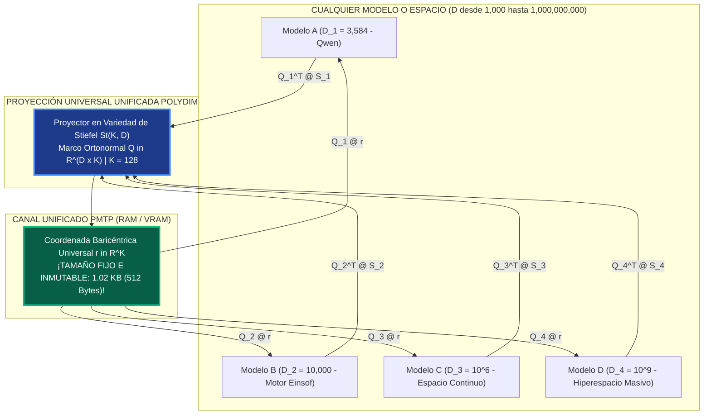

# 🏛️ UNIFICACIÓN ARQUITECTÓNICA EN POLYDIM: EL MARCO UNIVERSAL STIEFEL St(K, D)
## Por qué TODAS las dimensiones (desde D=1,000 hasta D=10^9) operan bajo la misma proyección

---

## 1. EL PRINCIPÍO DE UNIFICACIÓN TOTAL

La pregunta fundamental: **¿Por qué separar $D \le 10^6$ y $D \ge 10^9$ cuando la Variedad de Stiefel $St(K, D)$ soluciona ambos casos de forma unificada?**

La respuesta es: **SE PUEDE Y SE DEBE UNIFICAR TODO BAJO $St(K, D)$.**

---

## 2. BENEFICIOS DE LA ARQUITECTURA UNIFICADA STIEFEL

1. **Tamaño de Mensaje Inmutable (1.02 KB):**
   - Sin importar si la dimensión del modelo es $D = 4,096$ o $D = 1,000,000,000$, la trama enviada por PMTP mide **exactamente 512 bytes / 1.02 KB**.
   - Cero variabilidad de buffer, cero re-alocación de memoria en C++.

2. **Compatibilidad Inter-Modelo Heterogénea Automática:**
   - Permite que un modelo pequeño ($D=3584$) y un modelo gigante ($D=10^7$) conversen directamente en el espacio latente sin necesitar la misma dimensión.

3. **Garantía Física Anti-OOM Total:**
   - Dado que el transporte y la manipulación de estados se hacen en $r \in \mathbb{R}^K$ ($K=128$), la memoria requerida en la autopista PMTP es constante $\mathcal{O}(K)$, eliminando cualquier peligro de desbordamiento de RAM/VRAM en cualquier silicio.

4. **Operación Dual (Denso vs Proyectado):**
   - **En el Nodo Local:** El agente puede calcular transformaciones en $D$ si el hardware lo soporta (ej. GPU/AVX2).
   - **En la Red / PMTP:** Todo mensaje entre agentes viaja proyectado en $r \in \mathbb{R}^K$.

---
*Documentado formalmente en `DOCUMENTACION\05_ARQUITECTURA_UNIFICADA_STIEFEL_TODAS_LAS_DIMENSIONES.md`.*
