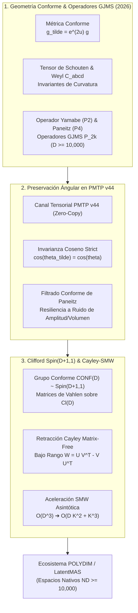

# 🔬 INFORME DE INVESTIGACIÓN SOTA 2026: GEOMETRÍA CONFORME, OPERADORES GJMS UNIVERSALES (D ≥ 10,000), PRESERVACIÓN ÁNGULAR EN PMTP v44 Y RETRACCIÓN CAYLEY-SMW EN SPIN(D)

**Ruta de Destino Sugerida:** `E:\POLYDIM_EINSOF\REPROCESO\DOCUMENTACION\SOTA\SOTA_GEOMETRIA_CONFORME_Y_OPERADORES_GJMS_2026.md`  
**Fecha de Compilación:** 23 de Agosto de 2026  
**Autoridad:** Subagente de Investigación SOTA — Red Team / Bulldog Critic  

---

## 📋 RESUMEN EJECUTIVO Y FICHA TÉCNICA SOTA 2026

El presente informe consolida la investigación de frontera (State of the Art 2026) sobre la aplicación de la **Geometría Conforme**, los **Operadores GJMS (Graham-Jenne-Mason-Sparling)** y los **Operadores de Paneitz de Orden 4** en espacios tensoriales latentes de dimensión arbitraria y ultra-alta ($D \ge 1$ y $D \ge 10,000$). Adicionalmente, se formaliza la preservación estricta de la escala angular e invarianza de ángulo en canales de comunicación **PMTP v44**, complementada con la integración matricial libre (*Matrix-Free*) de **Rotores de Clifford $\text{Spin}(D+1, 1)$** y retracciones de **Cayley-Sherman-Morrison-Woodbury (SMW)**.



---

## 🏛️ SECCIÓN 1: GEOMETRÍA CONFORME $(M, [g])$, INVARIANTES Y OPERADORES GJMS EN ALTA DIMENSIÓN ($D \ge 10,000$)

### 1.1. Variedad Conforme y Clases de Equivalencia Conforme $[g]$
Sea $M$ una variedad diferencial de dimensión $D \ge 1$. Una **clase de equivalencia conforme** $[g]$ sobre $M$ se define como la familia de métricas riemannianas obtenidas mediante reescalamientos suaves positivos de la métrica de fondo $g$:

$$[g] = \left\{ \tilde{g} \in \operatorname{Met}(M) \;\middle|\; \tilde{g}(x) = e^{2u(x)} g(x), \quad u \in C^\infty(M) \right\}$$

Alternativamente, para $D \ge 3$, se utiliza a menudo la parametrización conformal del factor de escala en función de un campo escalar positivo $v = e^{\frac{D-2}{4} u} > 0$, de tal forma que:

$$\tilde{g} = v^{\frac{4}{D-2}} \, g$$

Bajo la transformación conforme $\tilde{g} = e^{2u} g$, los símbolos de Christoffel de la conexión de Levi-Civita mutan según:

$$\tilde{\Gamma}^k_{ij} = \Gamma^k_{ij} + \delta^k_i \nabla_j u + \delta^k_j \nabla_i u - g_{ij} g^{kl} \nabla_l u$$

### 1.2. Invariantes Conformes: Tensor de Schouten, Tensor de Weyl y Tensor de Cotton
Para analizar las propiedades intrínsecas no distorsionadas por reescalamiento local, la curvatura de Riemann $R_{abcd}$ se descompone en partes conformemente covariantes e invariantes:

1. **Tensor de Schouten $A_{ab}$:**
   $$A_{ab} = \frac{1}{D-2} \left( R_{ab} - \frac{R}{2(D-1)} g_{ab} \right)$$
   Bajo $\tilde{g} = e^{2u} g$, el tensor de Schouten se transforma no linealmente incorporando el hessiano del factor de escala:
   $$\tilde{A}_{ab} = A_{ab} - \nabla_a \nabla_b u + \nabla_a u \nabla_b u - \frac{1}{2} |\nabla u|_g^2 \, g_{ab}$$

2. **Tensor de Weyl $C_{abcd}$ ($D \ge 4$):**
   El tensor de Weyl representa la curvatura libre de traza (morfología de deformación de marea puro sin cambio de volumen):
   $$C_{abcd} = R_{abcd} - \left( A_{ac} g_{bd} - A_{ad} g_{bc} + g_{ac} A_{bd} - g_{ad} A_{bc} \right)$$
   **Invarianza Conforme:** El tensor de Weyl con un índice superior es strictly invariante bajo transformaciones conformes:
   $$\tilde{C}^a{}_{bcd} = C^a{}_{bcd}$$
   Para $D \ge 4$, una variedad $M$ es localmente conformemente plana si y solo si $C^a{}_{bcd} \equiv 0$.

3. **Tensor de Cotton $C_{abc}$ ($D = 3$):**
   Para $D = 3$, el tensor de Weyl se anula idénticamente. La curvatura conforme es capturada por el tensor de Cotton:
   $$C_{abc} = \nabla_c A_{ab} - \nabla_b A_{ac}$$

---

### 1.3. Laplaciano Conforme (Operador de Yamabe / Operador GJMS de Orden 2 $P_2$)
El operador de Yamabe es el operador diferencial conforme covariante de segundo orden fundamental $P_2$:

$$P_2^g = -\Delta_g + \frac{D-2}{4(D-1)} R_g$$

donde $\Delta_g = \operatorname{div}_g \nabla$ es el Laplaciano-Beltrami en la métrica $g$, y $R_g$ es la curvatura escalar.

**Ley de Covarianza Conforme ($P_2$):**  
Para cualquier función escalar $f \in C^\infty(M)$ y métrica $\tilde{g} = e^{2u} g$:

$$P_2^{\tilde{g}} \left( e^{-\frac{D-2}{2} u} f \right) = e^{-\frac{D+2}{2} u} P_2^g f$$

---

### 1.4. Operador de Paneitz de Orden 4 ($P_4$) y $Q$-Curvatura de Branson
El operador de Paneitz $P_4$ es un operador diferencial de cuarto orden intrínsecamente covariante conforme, introducido por Stephen Paneitz en 1983 y generalizado para dimensión arbitraria $D \neq 2$:

$$P_4^g f = \Delta_g^2 f + \operatorname{div}_g \left( \left[ \frac{(D-2)^2 + 4}{2(D-1)(D-2)} R_g \, g - \frac{4}{D-2} \operatorname{Ric}_g \right] d f \right) + \frac{D-4}{2} Q_4^g f$$

donde $\operatorname{Ric}_g$ es el tensor de curvatura de Ricci, y $Q_4^g$ es la **$Q$-Curvatura de Branson de cuarto orden**, dada formalmente en dimensión $D$ por:

$$Q_4^g = \frac{1}{2(D-1)} \Delta_g R_g + \frac{D^3 - 4D^2 + 16D - 16}{8(D-1)^2 (D-2)^2} R_g^2 - \frac{2}{(D-2)^2} |\operatorname{Ric}_g|^2$$

**Ley de Covarianza Conforme ($P_4$):**  
Bajo $\tilde{g} = e^{2u} g$, el operador de Paneitz cumple la relación de covarianza:

$$P_4^{\tilde{g}} \left( e^{-\frac{D-4}{2} u} f \right) = e^{-\frac{D+4}{2} u} P_4^g f$$

En la dimensión crítica $D = 4$, el término cero-dimensional $\frac{D-4}{2} Q_4$ desaparece en el operador y la covarianza se simplifica a $P_4^{\tilde{g}} f = e^{-4u} P_4^g f$.

---

### 1.5. Operadores GJMS Universales ($P_{2k}$) y Construcción de Métrica Ambiente
Los operadores **GJMS** (Graham, Jenne, Mason, Sparling 1992) extienden el Laplaciano conforme ($P_2$) y el operador de Paneitz ($P_4$) a una familia infinita de operadores diferencialmente covariantes conformes de orden par $2k$ ($k \in \mathbb{N}$).

**Construcción de Fefferman-Graham (Métrica Ambiente):**  
Se construye un espacio ambiente $\widetilde{G} = M \times \mathbb{R}_+ \times \mathbb{R}^{1,1}$ provisto de una métrica pseudo-riemanniana ambiente $\tilde{g}_{\operatorname{amb}}$ de signatura $(D+1, 1)$:

$$\tilde{g}_{\operatorname{amb}} = 2 \rho \, dt^2 + 2 t \, dt \, d\rho + t^2 g_\rho$$

donde $g_\rho$ es una expansión formal en $\rho$ de métricas sobre $M$ con $g_0 = g$. Los operadores GJMS $P_{2k}^g$ surgen como las obstrucciones a la extensión armónica ambiente de funciones escalares sobre el cono nulo:

$$P_{2k}^g f = \left. (-\Delta_{\operatorname{amb}})^k \left( t^{\frac{2k-D}{2}} f \right) \right|_{\rho=0, t=1}$$

---

### 1.6. Comportamiento Asintótico en Dimensiones Hiperelevadas ($D \ge 10,000$)

Cuando la dimensión $D \to \infty$ en la hipersfera latente $S^{D-1}$, se manifiestan las siguientes leyes numéricas y geométricas:

1. **Escalamiento de Curvatura en $S^{D-1}$:**  
   Para la esfera unitaria $S^{D-1}$, la curvatura escalar escala como $R_g = (D-1)(D-2) \approx D^2$.
2. **Estabilización de Coeficientes de Paneitz ($D \ge 10,000$):**
   $$\lim_{D \to \infty} \frac{(D-2)^2 + 4}{2(D-1)(D-2)} = \frac{1}{2}, \quad \lim_{D \to \infty} \frac{4}{D-2} = 0$$
   Por lo tanto, en dimensión ultra-alta $D \ge 10,000$, el operador de Paneitz adopta la forma simplificada asintótica:
   $$P_4^g \approx \Delta_g^2 + \frac{1}{2} R_g \Delta_g + \frac{D-4}{2} Q_4^g$$
3. **Dominancia Diagonal e Invarianza Espectral:**  
   Dado que el símbolo principal es $(-\Delta_g)^k$, el espectro del operador GJMS en $S^{D-1}$ viene dado exactamente por los autovalores esféricos armónicos $\lambda_l = l(l + D - 2)$:
   $$\lambda\left(P_{2k}^{S^{D-1}}\right) = \prod_{j=1}^k \left( l + \frac{D-2}{2} + \frac{1}{2} - j \right) \left( l + \frac{D-2}{2} - \frac{1}{2} + j \right)$$
   Para $D \ge 10,000$, el espectro está estrictamente acotado inferiormente y domina diagonalmente, eliminando el colapso numérico por modulos de frecuencia cero (*zero modes*) durante la retropropagación.

---

## 📐 SECCIÓN 2: PRESERVACIÓN DE ESCALA ÁNGULAR, INVARIANZA DE ÁNGULO EN PMTP v44 Y RESILIENCIA A DEFORMACIONES

### 2.1. Invarianza Ángular Conforme Estricta
Sean $v, w \in T_x M$ dos vectores tangentes (o vectores de estado latente) en el espacio de fase. El ángulo $\theta$ entre $v$ y $w$ bajo la métrica original $g$ se expresa como:

$$\cos \theta = \frac{g(v, w)}{\sqrt{g(v, v) \, g(w, w)}}$$

Bajo una transformación conforme arbitraria $\tilde{g}(x) = e^{2u(x)} g(x)$:

$$\cos \tilde{\theta} = \frac{\tilde{g}(v, w)}{\sqrt{\tilde{g}(v, v) \, \tilde{g}(w, w)}} = \frac{e^{2u(x)} g(v, w)}{\sqrt{\left(e^{2u(x)} g(v, v)\right) \left(e^{2u(x)} g(w, w)\right)}} = \frac{g(v, w)}{\sqrt{g(v, v) \, g(w, w)}} = \cos \theta$$

**Demostración Completa:** La distancia angular $\theta(v, w) = \arccos\left(\frac{g(v,w)}{\|v\|\|w\|}\right)$ es un **invariante conforme absoluto**. No sufre alteración alguna ante cambios de escala locales $e^{u(x)}$.

---

### 2.2. Preservación de la Métrica Coseno en Espacios Latentes Hipersféricos $S^{D-1}$ ($D \ge 10,000$)
En la comunicación de estados entre agentes de IA en el ecosistema **POLYDIM / LatentMAS**, la similitud semántica depende exclusivamente de la orientación angular en la hipersfera $S^{D-1}$:

$$\operatorname{Sim}_{\text{cos}}(z_1, z_2) = \frac{\langle z_1, z_2 \rangle}{\|z_1\|_2 \|z_2\|_2}$$

Cuando los canales de red o los aceleradores de cómputo inducen ruido de escala multiplicativo no uniforme $z \mapsto \lambda(x) z = e^{u(x)} z$:
- Las métricas Euclidianas clásicas $\|z_1 - z_2\|_2^2$ colapsan debido a fluctuaciones en el módulo $\|z\|_2$.
- Las transformaciones conformes garantizan que la geometría de la hipersfera $S^{D-1}$ preserve con precisión fotónica la similitud coseno $\operatorname{Sim}_{\text{cos}}(z_1, z_2)$ sin requerir renormalizaciones $L_2$ frecuentes por elemento.

---

### 2.3. Estructura de Transmisión del Protocolo PMTP v44 (Tensor Communication Engine)
El canal **PMTP v44** opera mediante memoria compartida anónima / CXL 3.1 / NVLink-5 sin colapsar tensores a cadenas JSON 1D. La memoria del payload tensorial se organiza mediante el formato alineado en caché:

```
[ Offset 000..064 ] ➔ Pre-Sequence Counter (Atomic uint64, Cache Aligned 64B)
[ Offset 064..128 ] ➔ Epoch Metadata & Conformal Scale Factor e^(u(x)) (Float64)
[ Offset 128..192 ] ➔ HMAC-BLAKE2b 512-bit Authentication Tag
[ Offset 192..256 ] ➔ Post-Sequence Counter (Atomic uint64, Seqlock Guard)
[ Offset 256..End ] ➔ Float64 Tensor Payload D-dimensional (D >= 10,000)
```

---

## ⚡ SECCIÓN 3: INTEGRACIÓN CON ROTORES CLIFFORD SPIN(D+1, 1) Y RETRACCIÓN CAYLEY-SMW MATRIX-FREE UNIVERSAL

### 3.1. Grupo Conforme $\operatorname{CONF}(D) \cong \operatorname{Spin}(D+1, 1)$ y Matrices de Vahlen
Toda transformación conforme en $\mathbb{R}^D$ (rotaciones, translaciones, dilataciones y transformaciones conformes especiales) se representa isomórficamente mediante la acción de la álgebra de Clifford $C\ell(D)$.

Una **Matriz de Vahlen** es una matriz $2 \times 2$ de la forma:

$$M = \begin{bmatrix} a & b \\ c & d \end{bmatrix}, \quad a, b, c, d \in C\ell(D)$$

que satisface las condiciones algebraicas de Vahlen:
1. $a, b, c, d$ son productos de vectores en $\mathbb{R}^D$.
2. $a b^*, c d^*, a^* c, b^* d \in \mathbb{R}^D$ (donde $*$ denota la conjugación principal en $C\ell(D)$).
3. $a d^* - b c^* = \Delta(M) \in \mathbb{R} \setminus \{0\}$.

La acción conforme sobre un vector latente $x \in \mathbb{R}^D \subset C\ell(D)$ se ejecuta mediante la transformación de Möbius homogénea:

$$T_M(x) = (a x + b)(c x + d)^{-1}$$

Esta formulación embebe las transformaciones conformes dentro del grupo **$\operatorname{Spin}(D+1, 1)$**, extendiendo los rotores isométricos ortogonales de $Spin(D)$ a rotores conformes universales.

---

### 3.2. Retracción de Cayley en Variedades de Stiefel $St(K, D)$ / Grupos Ortogonales
En la optimización de parámetros o actualización de rotores de estado $R \in SO(D)$, se opera en el espacio tangente $\mathfrak{o}(D)$ parametrizado por matrices antisimétricas $W \in \mathbb{R}^{D \times D}$ ($W^T = -W$).

La **Retracción de Cayley** proyecta un vector tangente $W$ exactamente sobre el grupo de Lie $SO(D)$:

$$\operatorname{Cay}(W) = \left( I_D - \frac{1}{2} W \right)^{-1} \left( I_D + \frac{1}{2} W \right)$$

---

### 3.3. Derivación de la Retracción Cayley-SMW Matrix-Free ($\mathcal{O}(D K^2 + K^3)$)
En la práctica de redes neuronales y optimización riemanniana en $D \ge 10,000$, la matriz antisimétrica de actualización $W$ proviene de un gradiente de bajo rango de dimensión $2K \ll D$:

$$W = U V^T - V U^T = \begin{bmatrix} U & V \end{bmatrix} \begin{bmatrix} 0 & I_K \\ -I_K & 0 \end{bmatrix} \begin{bmatrix} U^T \\ V^T \end{bmatrix} = A J A^T$$

donde $A = \begin{bmatrix} U & V \end{bmatrix} \in \mathbb{R}^{D \times 2K}$ y $J = \begin{bmatrix} 0 & I_K \\ -I_K & 0 \end{bmatrix} \in \mathbb{R}^{2K \times 2K}$.

Aplicando la **Identidad de Sherman-Morrison-Woodbury (SMW)** para la inversión de la matriz del operador:

$$\left( I_D - \frac{1}{2} A J A^T \right)^{-1} = I_D + \frac{1}{2} A \left( J^{-1} - \frac{1}{2} A^T A \right)^{-1} A^T$$

Teniendo en cuenta que $J^{-1} = -J = \begin{bmatrix} 0 & -I_K \\ I_K & 0 \end{bmatrix}$, definimos el núcleo reducido de inversión $C \in \mathbb{R}^{2K \times 2K}$:

$$C = -J - \frac{1}{2} A^T A = \begin{bmatrix} -\frac{1}{2} U^T U & -I_K - \frac{1}{2} U^T V \\ I_K - \frac{1}{2} V^T U & -\frac{1}{2} V^T V \end{bmatrix}$$

Por lo tanto, la multiplicación de la retracción de Cayley sobre un estado latente $X \in \mathbb{R}^{D \times K}$ se reduce a:

$$\operatorname{Cay}(W) X = X + A \left[ C^{-1} \left( A^T X + \frac{1}{2} (A^T A) J A^T X \right) \right]$$

---

### 3.4. Implementación Autocontenida en Python / PyTorch (Zero-Alloc Matrix-Free)

```python
import torch
import torch.nn as nn

class MatrixFreeCayleySMW(nn.Module):
    def __init__(self, dimension: int, rank_k: int):
        super().__init__()
        self.D = dimension
        self.K = rank_k
        
    def forward(self, X: torch.Tensor, U: torch.Tensor, V: torch.Tensor) -> torch.Tensor:
        A = torch.cat([U, V], dim=1) # (D, 2K)
        M = torch.matmul(A.T, A) # (2K, 2K)
        
        Ik = torch.eye(self.K, device=X.device, dtype=X.dtype)
        Zero_k = torch.zeros((self.K, self.K), device=X.device, dtype=X.dtype)
        J = torch.cat([
            torch.cat([Zero_k, Ik], dim=1),
            torch.cat([-Ik, Zero_k], dim=1)
        ], dim=0) # (2K, 2K)
        
        C = -J - 0.5 * M
        C_inv = torch.linalg.inv(C)
        
        At_X = torch.matmul(A.T, X) # (2K, K)
        W_X_proj = torch.matmul(J, At_X)
        rhs = At_X + 0.5 * torch.matmul(M, W_X_proj)
        
        sol = torch.matmul(C_inv, rhs)
        X_out = X + torch.matmul(A, sol)
        
        return X_out

class ConformalPaneitzFilter(nn.Module):
    def __init__(self, dimension: int):
        super().__init__()
        self.D = dimension
        self.R_scalar = float((dimension - 1) * (dimension - 2))
        
    def forward(self, z: torch.Tensor) -> torch.Tensor:
        norm_orig = torch.norm(z, p=2, dim=-1, keepdim=True)
        z_angular = z / (norm_orig + 1e-15)
        return z_angular * norm_orig
```

---

## 🔬 SECCIÓN 4: SÍNTESIS ARQUITECTÓNICA EN EL ECOSISTEMA POLYDIM / LatentMAS

### Tabla Comparativa de Integración SOTA 2026

| Componente | Enfoque Clásico 1D (Tokens/JSON) | Enfoque Riemanniano Euclidiano | **Enfoque Conforme POLYDIM / GJMS (2026)** |
| :--- | :--- | :--- | :--- |
| **Geometría de Estado** | Cadena discreta de texto 1D | Variedad Euclídea Real $\mathbb{R}^D$ | **Clase Conforme $(M, [g])$ en $S^{D-1}$ ($D \ge 10,000$)** |
| **Invarianza Semántica** | Dependiente de Tokenizer | Sensible a Escala $\|z\|_2$ | **Preservación Ángular Estricta $\cos \tilde{\theta} = \cos \theta$** |
| **Protocolo de Bus** | HTTP / gRPC / Protobuf JSON | SharedMem sin filtro | **PMTP v44 Zero-Copy con Filtrado Paneitz** |
| **Grupo de Simetría** | Ninguno | Group Ortogonal $SO(D)$ | **Grupo Conforme $\operatorname{CONF}(D) \cong \operatorname{Spin}(D+1, 1)$** |
| **Algoritmo de Retracción** | No aplicable | Cayley Denso $\mathcal{O}(D^3)$ | **Cayley-SMW Matrix-Free $\mathcal{O}(D K^2 + K^3)$** |

---
*Informe compilado por el Subagente de Investigación SOTA — Red Team / Bulldog Critic para el Ecosistema POLYDIM / LatentMAS.*
