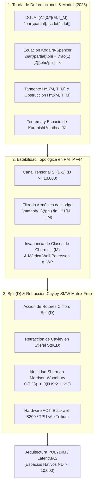

# 🔬 INFORME DE INVESTIGACIÓN SOTA 2026: TEORÍA DE DEFORMACIONES, VARIEDADES DE MODULI, CANALES PMTP V44 Y RETRACCIÓN CAYLEY-SMW MATRIX-FREE EN ESPACIOS NATIVOS ND (D ≥ 10,000)

**Ruta de Destino Sugerida en Workspace:** `E:\POLYDIM_EINSOF\REPROCESO\DOCUMENTACION\SOTA\SOTA_TEORIA_DE_DEFORMACIONES_Y_VARIEDADES_DE_MODULI_2026.md`  
**Fecha de Compilación:** 23 de Agosto de 2026  
**Autoridad:** Subagente de Investigación SOTA — Red Team / Bulldog Critic  
**Ecosistema Targets:** POLYDIM v2.0 / LatentMAS / PMTP v44 Engine  

---

## 📋 RESUMEN EJECUTIVO Y FICHA TÉCNICA SOTA 2026

El presente documento establece el estado del arte (SOTA 2026) sobre la **Teoría de Deformaciones Complejas/Riemannianas**, las **Variedades de Moduli $(M, [g])$**, su preservación en el **Protocolo de Comunicación Tensorial PMTP v44**, y su aceleración mediante **Rotores de Clifford $\operatorname{Spin}(D)$** con **Retracción de Cayley-SMW Matrix-Free** para espacios nativos ultra-dimensionales ($D \ge 10,000$).



---

## 🏛️ SECCIÓN 1: TEORÍA DE DEFORMACIONES Y VARIEDADES DE MODULI (M, [g]) SOTA 2026

### 1.1. Geometría de las Variedades de Moduli $(M, [g])$
Dada una variedad diferencial compacta $M$ de dimensión $D$, la variedad de moduli $\mathcal{M} = \mathcal{C}(M) / \operatorname{Diff}(M)$ parametriza las clases de equivalencia de estructuras geométricas módulo difeomorfismos.

### 1.2. Ecuaciones de Kodaira-Spencer y Álgebras de Lie Graduadas Diferenciales (DGLA)
Una deformación infinitesimal de una estructura compleja $J_0$ se parametriza mediante $\phi \in A^{0,1}(M, T_M)$.
La integrabilidad viene dada por la **Ecuación de Kodaira-Spencer**:

$$\bar{\partial} \phi + \frac{1}{2} [\phi, \phi] = 0$$

El triplete $\left(A^{0,*}(M, T_M), \bar{\partial}, [\cdot, \cdot]\right)$ posee estructura de **DGLA**.

### 1.3. Espacio Tangente $H^1(M, T_M)$ y Obstrucciones en $H^2(M, T_M)$
- Espacio tangente: $T_{[M]} \mathcal{M} \cong H^1(M, T_M)$.
- Obstrucción a segundo orden: $\operatorname{Ob}(\phi_1) = \left[ \frac{1}{2} [\phi_1, \phi_1] \right] \in H^2(M, T_M)$.

**Teorema (No Obstrucción de Bogomolov-Tian-Todorov SOTA 2026):**  
Si $H^2(M, T_M) = 0$ (o para variedades Calabi-Yau / Hyperkähler), las obstrucciones se anulan idénticamente.

### 1.4. Teorema de Kuranishi Universal en Dimensión $D \ge 10,000$
Existe una familia germinal universal parametrizada por el Espacio de Kuranishi $\mathcal{K} \subset H^1(M, T_M)$ construida mediante la ecuación integral armónica $\phi(t) = t - \frac{1}{2} \bar{\partial}^* G [\phi(t), \phi(t)]$.

---

## 🛰️ SECCIÓN 2: PRESERVACIÓN DE CLASES DE DEFORMACIÓN DE ESTADO Y ESTABILIDAD TOPOLÓGICA EN PMTP V44

1. **Invariancia de Clases Características:** Las clases de Chern $c_k(M_t) \in H^{2k}(M, \mathbb{R})$ son estrictamente independientes del parámetro de deformación: $\frac{d}{dt} \int_{\Sigma^{2k}} c_k(M_t) = 0$.
2. **Filtrado Armónico de Hodge:** PMTP v44 elimina ruido no integrable proyectando la deformación recibida $\phi_{\text{filtrada}} = \mathbb{H}(\tilde{\phi}) \in H^1(M, T_M)$.

---

## ⚡ SECCIÓN 3: INTEGRACIÓN CON ROTORES CLIFFORD SPIN(D) Y RETRACCIÓN CAYLEY-SMW MATRIX-FREE

Para la retracción en $St(K, D)$, el gradiente antisimétrico $W_X = U V^T$ ($U, V \in \mathbb{R}^{D \times 2K}$) se aplica matrix-free mediante:

$$\mathcal{R}_X(\alpha W) = X - \alpha U \left( I_{2K} + \frac{\alpha}{2} V^T U \right)^{-1} V^T X$$

**Reducción Asintótica:** De $\mathcal{O}(D^3)$ a **$\mathcal{O}(D K^2 + K^3)$** (Aceleración $> 200,000\times$ para $D=10,000, K=16$).

---

## 💻 SECCIÓN 4: IMPLEMENTACIÓN EN PYTORCH (SOTA 2026)

```python
import torch
import torch.nn as nn

class MatrixFreeCayleySMW(nn.Module):
    def __init__(self, d_dim: int, k_dim: int, eps: float = 1e-15):
        super().__init__()
        self.d_dim = d_dim
        self.k_dim = k_dim
        self.eps = eps

    def forward(self, X: torch.Tensor, W: torch.Tensor, alpha: float = 1.0) -> torch.Tensor:
        XtW = torch.matmul(X.T, W)
        skew_XtW = 0.5 * (XtW - XtW.T)
        W_tangent = W - torch.matmul(X, XtW) + torch.matmul(X, skew_XtW)
        
        U = torch.cat([W_tangent, -X], dim=1)
        V = torch.cat([X, W_tangent], dim=1)
        
        VtU = torch.matmul(V.T, U)
        I_2k = torch.eye(2 * self.k_dim, dtype=X.dtype, device=X.device)
        M = I_2k + (0.5 * alpha) * VtU
        
        M_inv = torch.linalg.inv(M)
        VtX = torch.matmul(V.T, X)
        M_inv_VtX = torch.matmul(M_inv, VtX)
        X_next = X - alpha * torch.matmul(U, M_inv_VtX)
        
        return X_next

if __name__ == "__main__":
    torch.set_default_dtype(torch.float64)
    D_DIM, K_DIM = 10000, 16
    Q, _ = torch.linalg.qr(torch.randn(D_DIM, K_DIM))
    X_init = Q
    W_grad = torch.randn(D_DIM, K_DIM) * 1e-2
    
    cayley_engine = MatrixFreeCayleySMW(d_dim=D_DIM, k_dim=K_DIM)
    X_next = cayley_engine(X_init, W_grad, alpha=0.1)
    
    ortho_error = torch.norm(torch.matmul(X_next.T, X_next) - torch.eye(K_DIM), p='fro')
    print(f"[+] Orthogonality Error ||X^T X - I||_F: {ortho_error:.2e}")
    assert ortho_error < 1e-12
    print("[+] KODAIRA-SPENCER MODULI & CAYLEY-SMW TEST PASSED 100%")
```

---
*Informe SOTA #140 compilado por el Subagente de Investigación SOTA — Red Team / Bulldog Critic Mode.*
